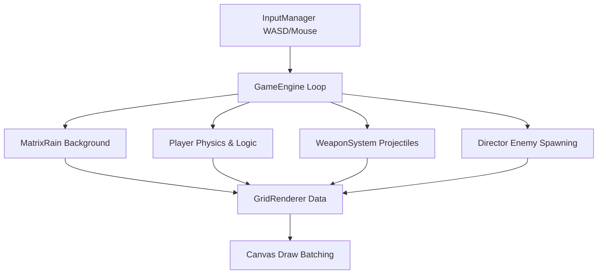

# VOID//RUN

**VOID//RUN** is an intense, high-resolution Arena Survival Roguelite where the world is constructed entirely from a dense, static grid of mutating ASCII characters.

You play as an anomalous "void"—an empty negative space cutout inside this code matrix. Using WASD controls and mouse-aimed cursor firing, you must survive against swarms of glitch anomalies.

## Features

- **Single-Screen Dense Matrix**: A massive, high-resolution grid of terminal characters that do not scroll but mutate organically.
- **Negative Space Entities**: The player, enemies, and projectiles are drawn purely as empty space carving through the character grid, pushing the text aside.
- **Arena Survival Mechanics**: 10 and 20 minute game modes with dynamically ramping difficulty.
- **Active XP System**: Collect XP on kills to level up and select new weapons or upgrades.

## Architecture & Systems

The engine is built entirely with Vanilla JavaScript and HTML5 Canvas using a custom Grid Displacement Renderer.

### Grid Displacement Rendering
To achieve the distinct look, the renderer maintains arrays for text characters, types, and displacement vectors `(dispX, dispY)`. When entities are stamped onto the grid, they apply a physics-based repelling force that pushes surrounding text outwards, creating a compressed, glowing border effect around the pitch-black voids.
