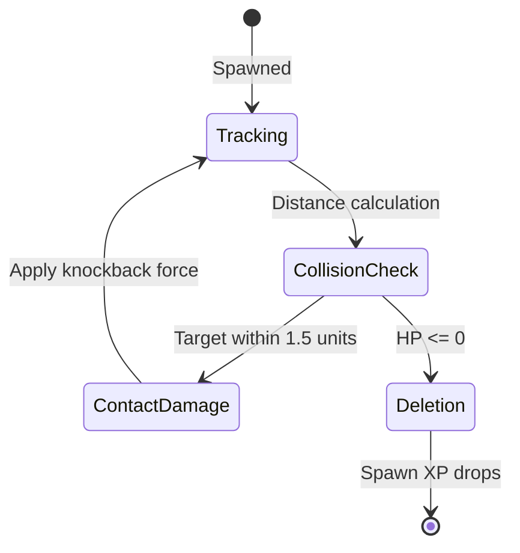
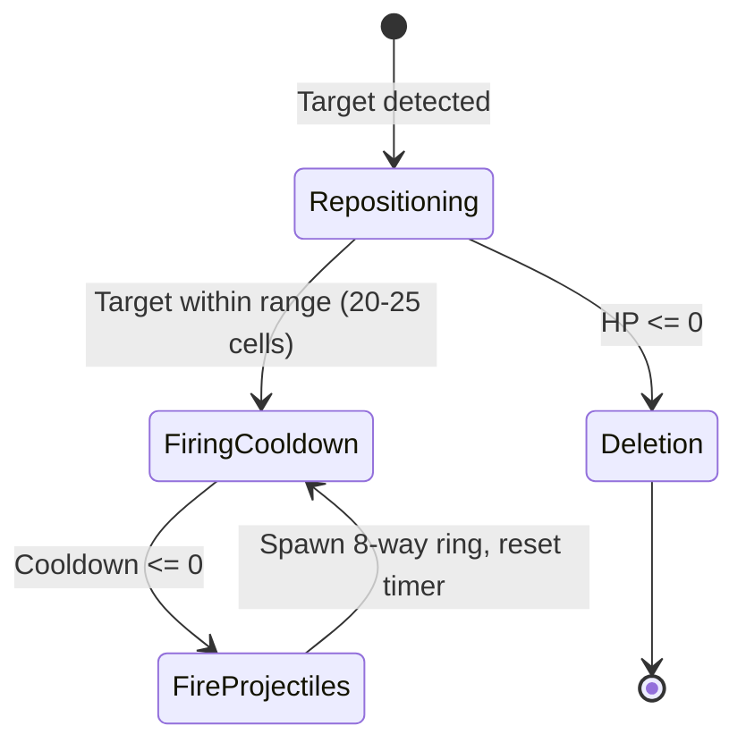
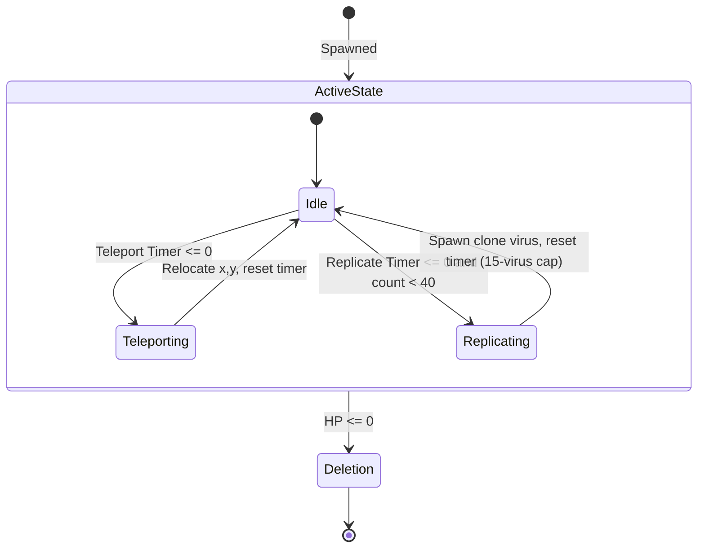
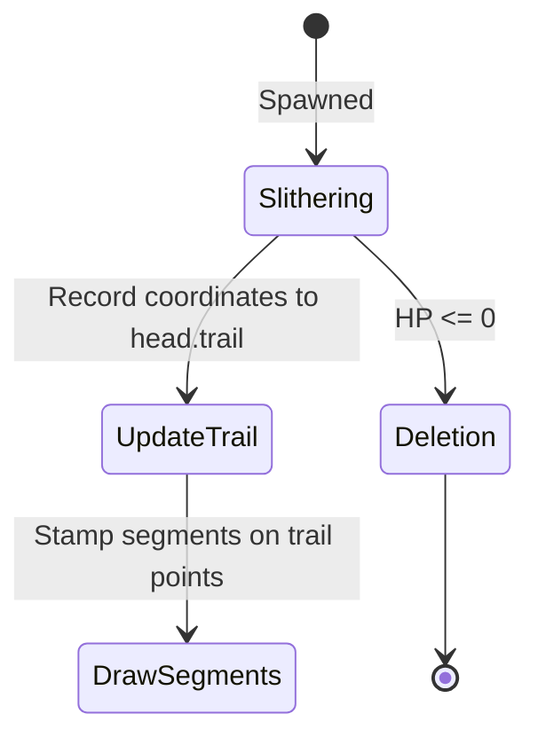
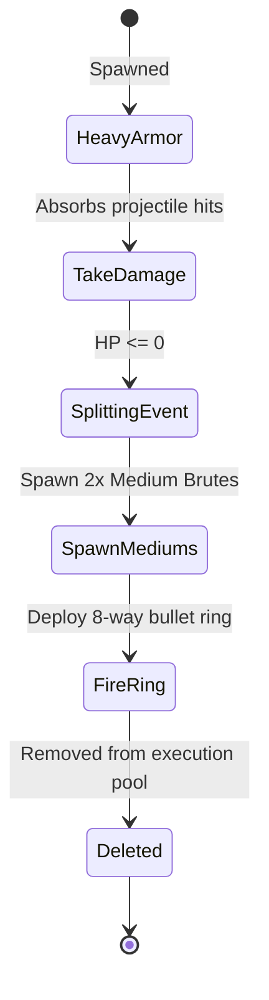
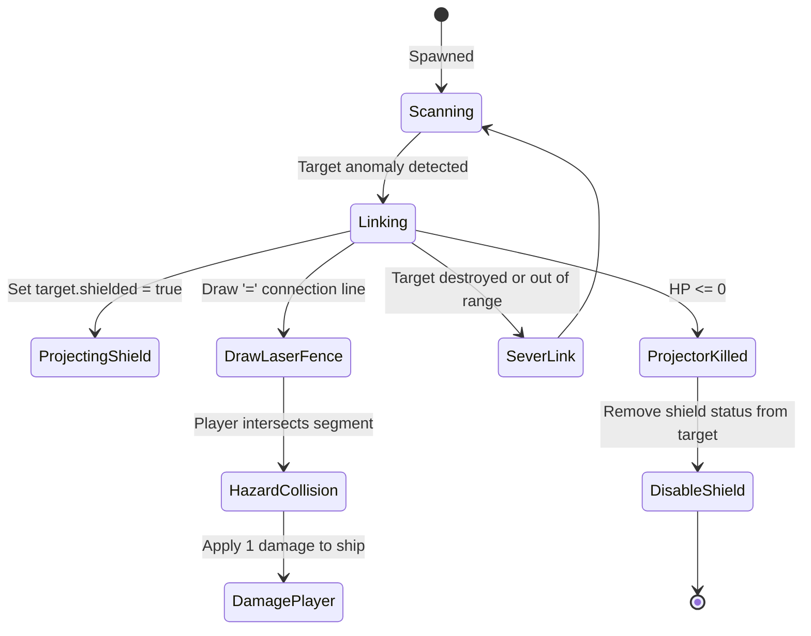
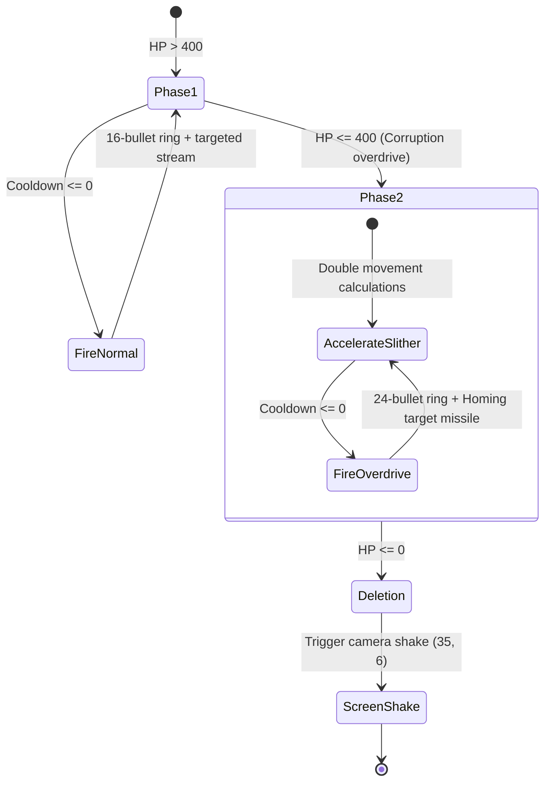
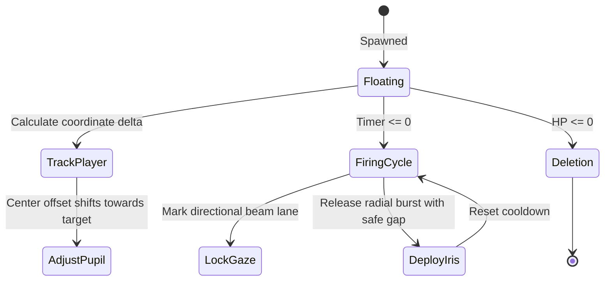
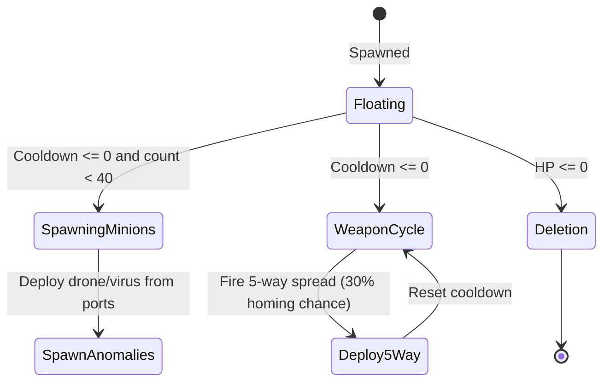
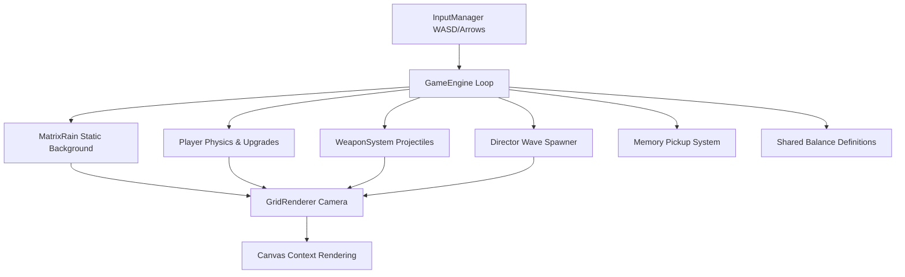

================================================================================
 __     ______  _____ _____    *    _____   _______ _____  
 \ \   / / __ \|_   _|  __ \  / \  |  __ \ |__   __|  __ \ 
  \ \_/ / |  | | | | | |  | |/ _ \ | |__) |   | |  | |__) |
   \   /| |  | | | | | |  | / ___ \|  _  /    | |  |  _  / 
    | | | |__| |_| |_| |__|/ ___ \ | | \ \    | |  | | \ \ 
    |_|  \____/|_____|_____/_/   \_\_|  \_\   |_|  |_|  \_\
================================================================================
                     MAINFRAME THREAT EVASION SYSTEM
                         SECURITY PROTOCOL: v2.0
================================================================================

VOID* PTR is an intense, retro-cyberpunk Arena Survival Roguelite where the world
is constructed from a large, static grid of mutating ASCII characters. Rendered
in a classic terminal Matrix Green (#00ff41) on a pitch-black background, the
player commands a glitching, living spacecraft fighting to survive against swarms
of corrupt autonomous threads.

================================================================================
[01] SYSTEM CONTROLS
================================================================================

VOID* PTR features a mouse-free, twin-stick keyboard layout for fluid combat:

+-------------------+---------------------------------------------------------+
| KEYBOARD INPUT    | SYSTEM ACTION DIRECTIVE                                 |
+-------------------+---------------------------------------------------------+
| W, A, S, D        | Shift player coordinate vector in 8 directions          |
| Spacebar          | Execute high-velocity dash (Invincibility frame active)  |
| Arrow Keys        | Deploy projectiles in 8 directions (diagonal combos)    |
| Escape or P       | Pause / Resume mainframe clock                          |
| Mouse Click       | Navigate GUI terminal selections                        |
| Arrows/WASD+Enter | Navigate and confirm all terminal menus                  |
| Gamepad Sticks/A  | Move, aim, fire and dash                                |
| Touch Gestures    | Twin-stick movement/aim; two-finger dash                 |
| F1                | Toggle the runtime diagnostics overlay                   |
+-------------------+---------------------------------------------------------+

================================================================================
[02] WEAPONS & UPGRADES REGISTER
================================================================================

--- SHIP CORE SCHEMATICS ---

1. Seeker Homing Pods (Left Module)
   - Payload: Target-acquiring self-guided rockets.
   - Yield: 5.0 base damage + 6-cell radius explosive splash damage.

2. Auto-Blaster (Middle Module)
   - Payload: Rapid fire linear bullet stream.
   - Yield: 5.0 base damage.

3. Null Laser (Right Module)
   - Payload: Instantaneous raycast piercing beam.
   - Range: 90 cells.
   - Yield: 4.0 base piercing damage per pulse; sustained fire builds heat.

--- UPGRADE MODULE POOL ---

System XP cores harvested from deleted threads trigger kernel upgrade selections:

*   MULTI-THREAD   [MAX LVL 4] : Increment active projectile streams.
*   OVERCLOCK      [MAX LVL 5] : Increase maximum ship flight speed.
*   TURBO BOOST    [MAX LVL 5] : Decrease weapon firing delay.
*   HELPER DRONE   [MAX LVL 3] : Deploy orbital drone nodes firing seeker rockets.
*   TESLA OVERLOAD [MAX LVL 3] : Discharge chain lightning arcs to nearby hostiles.
*   SHIELD MATRIX  [MAX LVL 3] : Project a rotating bracket shield ( = ).
*   SYSTEM FREEZE  [MAX LVL 3] : Freeze all hostile processes for 3.0 seconds.
*   STACK FLUSH    [MAX LVL 3] : Deploy periodic shockwave clearing enemy bullets.
*   DASH CORRUPTION [MAX LVL 3] : Dashing through hostiles deals 6/12/18 damage.
*   BLASTER AMP    [MAX LVL 4] : Add +2.0 damage to blaster projectiles.
*   SEEKER PROP    [MAX LVL 4] : Add +2.5 damage to seeker rockets.
*   LASER WIDENER  [MAX LVL 4] : Add +0.25 damage to Null Laser.
*   L1 CACHE       [MAX LVL 1] : Expand compiler upgrade card choices to 4.
*   KERNEL CORE    [MAX LVL 2] : Boost base engine speed & acceleration by 10%.
*   SWAP PARTITION [MAX LVL 2] : Restore integrity points; delete non-bosses.
*   REPAIR SECTOR  [UNLIMITED] : Restore 40% hull integrity (emergency fallback).
*   GARBAGE COLLECTOR [MAX LVL 3] : Increase memory-fragment attraction range.
*   STACK CANARY [MAX LVL 1] : Shield breaks flush nearby hostile bullets.
*   SEGFAULT TRAIL [MAX LVL 3] : Dashes leave damaging corruption.
*   POINTER ARITHMETIC [MAX LVL 1] : Null Laser reflects from memory barriers.
*   FORK BOMB [MAX LVL 2] : Killing shots fork into smaller projectiles.
*   UNDEFINED BEHAVIOR [MAX LVL 2] : Install a powerful random mutation.
*   MEMORY LEAK [MAX LVL 2] : Uncollected memory grows in value but attracts threats.

================================================================================
[03] ENEMY THREAT MANUAL & DATA FLOW DIAGRAMS
================================================================================

--------------------------------------------------------------------------------
DRONE (Process Swarmer)
--------------------------------------------------------------------------------
Specs: 14 HP | 15 XP | Mass 0.8
Behavior: Directly tracks player coordinates, attempting contact damage.

ASCII BEHAVIOR MODEL:
       [ (0-9) ]  <-- Blinking numeric core character
      . - ~ - .   
    (   Drone   ) <-- Organic metaball noise field
      ` - ~ - `

STATE MACHINE:

--------------------------------------------------------------------------------
SHOOTER (Ranged Projector)
--------------------------------------------------------------------------------
Specs: 25 HP | 25 XP | Mass 1.0
Behavior: Maintains tactical distance and shoots telegraphed six-way bullet rings.

ASCII BEHAVIOR MODEL:
      B U G
      E R R   <-- 3x3 character matrix firing projectiles
      V O I
        |
        +--> [ * ] [ * ] [ * ] <-- Fires 6-way radial projectile rings
        
STATE MACHINE:

--------------------------------------------------------------------------------
VIRUS (Erratic Replicator)
--------------------------------------------------------------------------------
Specs: 25 HP | 35 XP | Mass 1.2
Behavior: Erratically teleports and spawns clones when replicator timer expires.

ASCII BEHAVIOR MODEL:
       *   *
       *   *   <-- Warning characters: teleports and splits
       *   *

STATE MACHINE:

--------------------------------------------------------------------------------
WORM (Segmented Chain)
--------------------------------------------------------------------------------
Specs: 30 HP | 30 XP | Mass 1.1
Behavior: Moves in a wobbly sinewave path, leaving a trail of segments.

ASCII BEHAVIOR MODEL:
     (Head: S)  ~ ~ ~ (N) ~ ~ ~ (A) ~ ~ ~ (K) ~ ~ ~ (E) <-- Trailing segments

STATE MACHINE:

--------------------------------------------------------------------------------
BRUTE (Giant Splitting Tank)
--------------------------------------------------------------------------------
Specs: 60 HP | 50 XP | Mass 3.0
Behavior: Large armored block. Splits into 2 medium brutes and fires a ring on death.

ASCII BEHAVIOR MODEL:
     #####
     #####
     ##### <-- 5x5 armored character grid block
     #####
     #####
       |
       +--> On deletion: Spawns 2x Medium Brutes + 8-way Projectile Ring

STATE MACHINE:

--------------------------------------------------------------------------------
SHIELD PROJECTOR (Laser Fence Host)
--------------------------------------------------------------------------------
Specs: 35 HP | 40 XP | Mass 2.0
Behavior: Connects to targets. Player takes 1 damage if crossing connection links.

ASCII BEHAVIOR MODEL:
       +---+
       | P |  <-- Projector node
       +---+
         \
          \ = = = = = = = [= = Damaging laser fence connection (Deals 1 HP)]
           \
         [ Target ] <-- Shielded anomaly (Invulnerable while link is active)

STATE MACHINE:

================================================================================
[04] CLASS-1 EXCEPTION OVERLORDS (BOSS PROTOCOLS)
================================================================================

--------------------------------------------------------------------------------
FATAL_SNAKE.EXE (Segmented Void Devourer)
--------------------------------------------------------------------------------
Specs: 800 HP | 1000 XP | Size: 11x11 | Mass: 15.0
Behavior: Gigantic slithering mothership snake. Segment size scales dynamically
from 3 to 8. Slither velocity scales up dynamically as integrity falls below
50%. Fires 24-bullet radial waves and direct streams of seeking rocket bullets.

ASCII BEHAVIOR MODEL:
    ( Head: 11x11 ) === (Seg: 8) === (Seg: 6) === (Seg: 4) === (Seg: 3)

STATE MACHINE:

--------------------------------------------------------------------------------
SYS_OBSERVER.BAT (Intrusion Detection Core)
--------------------------------------------------------------------------------
Specs: 800 HP | 800 XP | Size: 15x15 | Mass: 12.0
Behavior: Massive ocular anomaly. Pupil tracks player movement in real-time.
Alternates between telegraphed gaze lanes and iris bursts with readable safe gaps.

ASCII BEHAVIOR MODEL:
         . - ~ ~ ~ - .
       /   * * * * *   \
      /  * * [███] * *  \  <-- Pupil [███] tracks player vectors
      \  * * [███] * *  /
       \   * * * * *   /
         ` - ~ ~ ~ - `

STATE MACHINE:

--------------------------------------------------------------------------------
SPAM_INJECTOR.SYS (Mainframe Replicator Mother)
--------------------------------------------------------------------------------
Specs: 900 HP | 800 XP | Size: 16x10 | Mass: 12.0
Behavior: Colossal command vessel featuring flickering exhaust ports. Launches
drones/viruses from its hangars and fires a 5-way projectile spread.

ASCII BEHAVIOR MODEL:
         ╔══╦═╦╦╦╦╦╦═╦══╗
     [H] ║██║ ║░░░░║ ║██║ [H] <-- Spawns minions from side hangars [H]
         ╚╦╦╝  ║║    ╚╦╦╝
          ▼▼   ▼▼     ▼▼  <-- Flickering engine flames
          
STATE MACHINE:

================================================================================
[05] SYSTEM ARCHITECTURE
================================================================================

Built with Vanilla JavaScript, HTML5 Canvas, and bundled with Vite.

Runs now use an encounter-budget director rather than an unstructured spawn ramp.
Finite runs schedule one authored boss at a time; Endless mode scales from elapsed
threat tiers and displays elapsed time. Deleted processes drop physical memory
fragments, creating a risk/reward collection layer. Four visual sectors—STACK,
HEAP, NULL, and KERNEL—give the world distinct code density and texture.

