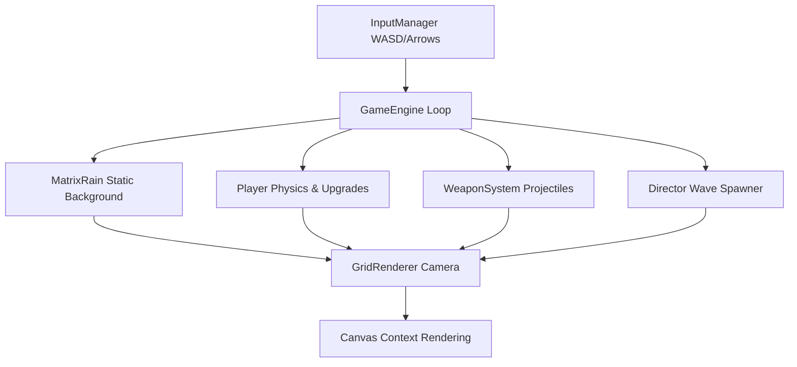

# 🟢 VOID* PTR

`VOID* PTR` is an intense, retro-cyberpunk Arena Survival Roguelite where the world is constructed from a large, static grid of mutating ASCII characters. Rendered in a classic terminal Matrix Green (`#00ff41`), the player commands a glitching, living spacecraft fighting to survive against swarms of corrupt autonomous threads.

---

## 🕹 Controls

`VOID* PTR` features a completely mouse-free, twin-stick keyboard setup for fluid retro-terminal combat:

| Key | Action |
|---|---|
| **`W` `A` `S` `D`** | Move ship in 8 directions |
| **`Spacebar`** | Dash through obstacles (provides temporary invincibility) |
| **`Arrow Keys`** | Shoot in 8 directions (diagonal combos supported, e.g. `Up` + `Right`) |
| **`Escape` or `P`**| Pause / Unpause the system |
| **`Mouse Click`** | Navigate menu selections |

---

## 🚀 Weapons & Upgrades

### Ship Configurations (Starting Weapons)
1. **Seeker Homing Pods** (Left Card) - Launches target-acquiring homing rockets. (Damage: `5`)
2. **Auto-Blaster** (Middle Card) - Fires high-frequency forward bullet streams. (Damage: `5`)
3. **Null Laser** (Right Card) - Casts an instant, piercing beam of light with an extended `90-cell` range. (Damage: `3`)

### Upgrade Pool
Level up by collecting XP dropped from deleted anomalies. Each module has a strict level cap and is filtered out once fully upgraded:
*   **MULTI-THREAD** `[Max LVL 4]`: Fire additional projectile streams.
*   **OVERCLOCK** `[Max LVL 5]`: Increase movement speed.
*   **TURBO BOOST** `[Max LVL 5]`: Boost weapon firing rate.
*   **HELPER DRONE** `[Max LVL 3]`: Spawn orbital drones firing homing seeker missiles.
*   **TESLA OVERLOAD** `[Max LVL 3]`: Shock nearby anomalies with passive chain lightning.
*   **SHIELD MATRIX** `[Max LVL 3]`: Deploys a rotating bracket-outline `( = )` shield blocking damage.
*   **SYSTEM FREEZE** `[Max LVL 3]`: Periodically freeze all enemies for 3 seconds.
*   **STACK FLUSH** `[Max LVL 3]`: Triggers a periodic shockwave clearing enemy bullets and damaging hostiles.
*   **DASH CORRUPTION** `[Max LVL 3]`: Dashing directly through anomalies deals heavy corruption damage (`6/12/18` HP).
*   **REPAIR SECTOR** `[Unlimited]`: Restores `2` integrity points (only offered if damaged).

---

## 👾 Rogue Anomalies & Bosses

### Standard Enemies
*   **Drone** (`14 HP`): Fast swarmer anomaly.
*   **Shooter** (`25 HP`): Keeps its distance and fires bullet rings.
*   **Virus** (`25 HP`): Erratically teleports and self-replicates.
*   **Worm** (`30 HP`): Slithers in sinewave chains chasing player coordinates.
*   **Brute** (`60 HP`): Large tank anomaly that splits into two `brute_medium` clones and fires a circular bullet ring on deletion.

### Boss Encounters (Summoned periodically)
*   **Fatal Snake Boss (`boss_snake`)** - Spawns at 1.5-minute offsets (1.5, 4.5, 7.5 mins). A giant, segmented slithering worm that fires massive bullet rings and shoots direct streams.
*   **Eye Boss (`boss_eye`)** - Spawns every 3 minutes. Casts sweeps of red projectiles and summons gravitational blackholes near the player.
*   **Carrier Boss (`boss_carrier`)** - Spawns every 3 minutes. A structured battleship that shoots triple target spreads and spawns drones/viruses from its side ports.

### Gravitational Hazards
*   **Blackholes** - Summond by `boss_eye`. Applies a powerful gravitational pull, dragging the player and surrounding anomalies towards its core. Standing in the center deals damage.

---

## 🎨 Visual Aesthetics & Audio

*   **Matrix Green Theme**: Styled entirely in monochrome green (`#00ff41`) on `#000000` black, mimicking a 1980s mainframe CRT terminal.
*   **Organic ASCII Shapes**: Enemies and trails are rendered as wobbly metaball clusters using random glyphs (`01.:;|/\-_`).
*   **Dynamic Background Seeding**: Features a dim, static background grid seeded with classic symbols and randomly placed father-themed words (`abu`, `father`, `papa`, `dad`, etc.).
*   **Card Drop Shadows**: Menu panels, ship selection, and level-up cards have a classic terminal 3D drop-shadow effect (`░`).
*   **Decoupled Audio**: Separated Music (ambient synthesizer loops) and Sound Effects (explosions, shooting, dashes). Buttons on the main menu toggle them immediately.

---

## 🤫 Developer Cheat Codes (Easter Eggs)

Type these during gameplay to trigger administrator overrides:
*   `sudo`: Grants 100 minutes of absolute invincibility and adds `1337` to your score.
*   `deadcode`: Triggers an instant level-up and prompts the upgrade selection screen.

---

## 💻 Tech Stack & Architecture

Built with Vanilla JavaScript, HTML5 Canvas, and bundled with Vite.

